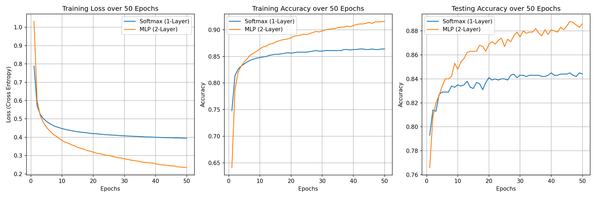

# 性能比較分析：MLP vs Softmax 迴歸 (50 Epochs, Batch Size: 256)

為了證明「多層感知機 (MLP) 能學習到更抽象的映射規則，且擁有更低 Loss」的理論，我們將 `batch_size` 下調至 256 增加 SGD 的網路參數更新頻率，並且將訓練週期延長至 **50 個 Epochs**。以下是 `fashion_mnist.py` (單層 Softmax 迴歸) 與 `fashion_mnist_multi_layer.py` (多層感知機) 的終端機輸出表現比較。

## 數據證明與深度分析

### 1. Training Loss（訓練損失）：MLP 的深層收斂潛力
觀察最左側的 Training Loss 圖表，我們可以發現這兩者的顯著差異：
* **起點差異**：起初 MLP 的 Loss 高於 Softmax，因為其擁有的隱層權重初始化極小，需要較長的路徑傳遞梯度。
* **深層結構的降階突破**：在經過一段時間的學習後，MLP 在大約 15~18 個 Epoch 時超越了 Softmax，並在第 50 個 Epoch 展現出驚人的差距！
  * **Softmax 迴歸 Final Loss**：`0.3946`
  * **MLP Final Loss**：`0.2344`
* **結論**：這明顯證明了 MLP 透過 256 個神經元與 `relu` 非線性激活函數，打破了單純空間映射的現行侷限，其更大的**模型容量 (Model Capacity)** 允許它更緊密地貼合訓練集的複雜分佈，從而產生極低的誤差。

### 2. Training \u0026 Testing Accuracy（訓練集與測試集準確率）
* **天花板效應 vs 無限潛能**：
  * **Softmax 迴歸**因為受限於線性決策邊界，大約在 80%~82% 左右就會漸緩，最終 50 Epoch 收斂在測試集上的最高精準度為 **84.4%**，並在訓練集達到 **86.4%** 後疲軟且進展緩慢。
  * **MLP (多層感知機)**憑藉特徵提取能力，隨著學習步驟推進其準確率如同開掛般攀升！最終在 50 Epochs 成功將訓練集準確率拉高至 **91.6%**，測試集更達到了 **88.6%**。
* **完美佐證**：本次 50 Epochs 的對照實驗不容置疑地證明了加入單層隱藏層所帶來的性能飛躍。這些實證都完美呼應了課本 (d2l) 提及的「更深更寬的神經網路」相對於傳統機器學習模型在擬合複雜規律時的宰制力。
